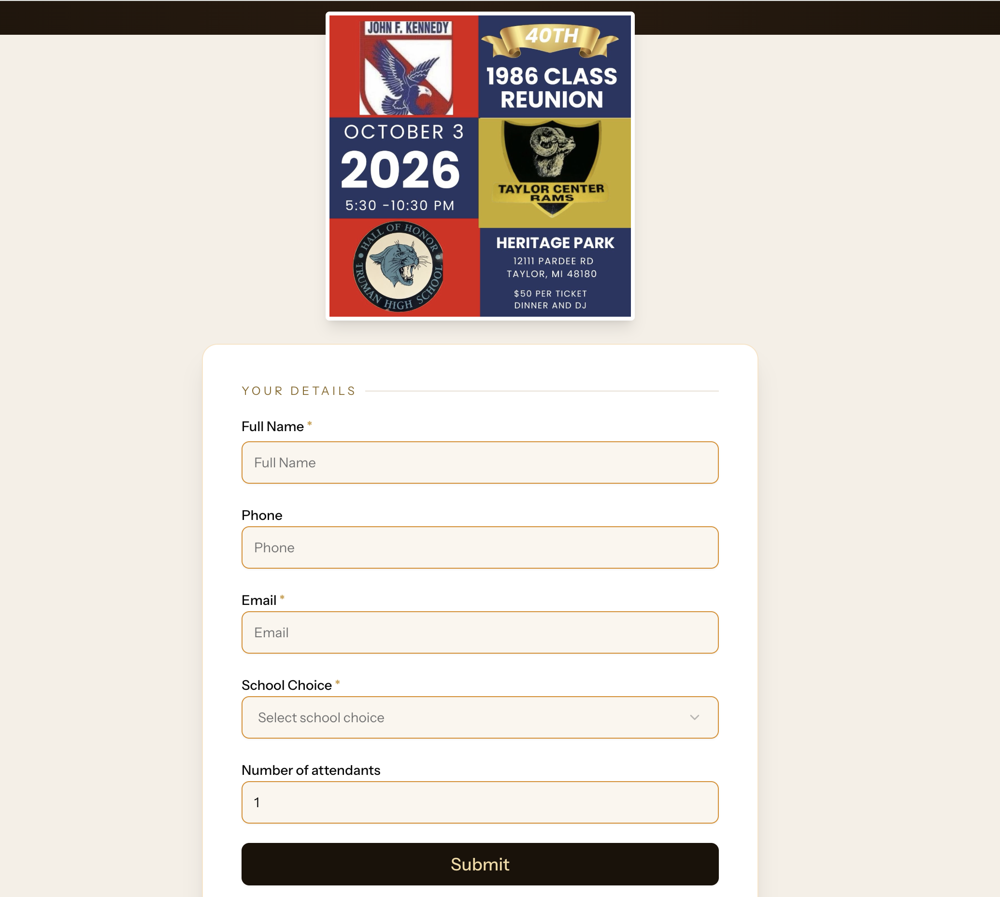
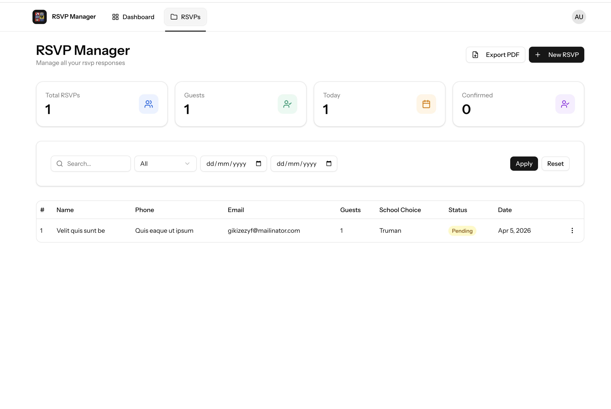

# 🎉 RSVP Management System

A simple and powerful RSVP (Event Registration) system built with **Laravel 12 and reactjs(inertia)**.  
This application allows event organizers to collect attendee information, manage responses, and export data for printing or reporting.

---

 

### RSVP Form

### Admin Dashboard

---

## Features

### ✅ Public RSVP Form
- Collect attendee details:
  - Name
  - Phone Number
  - Email Address
  - Number of Guests
  - Optional Message
- Form validation (email, phone, required fields)
- Success confirmation message

---

### Admin Dashboard
- View all RSVP submissions
- Search by name, email, or phone
- Sort by latest entries
- Summary cards:
  - Total RSVPs
  - Total Guests

---

### 📤 Export & Print
- Export RSVP data as:
  - PDF document
- Print-friendly attendee list

---
 
 

## 🛠️ Tech Stack

- **Backend:** :contentReference[oaicite:0]{index=0} 11  
- **Frontend:** TS/JSX/Shadcn + Tailwind CSS  
- **Database:** MySQL  
- **PDF Export:** DomPDF    

 